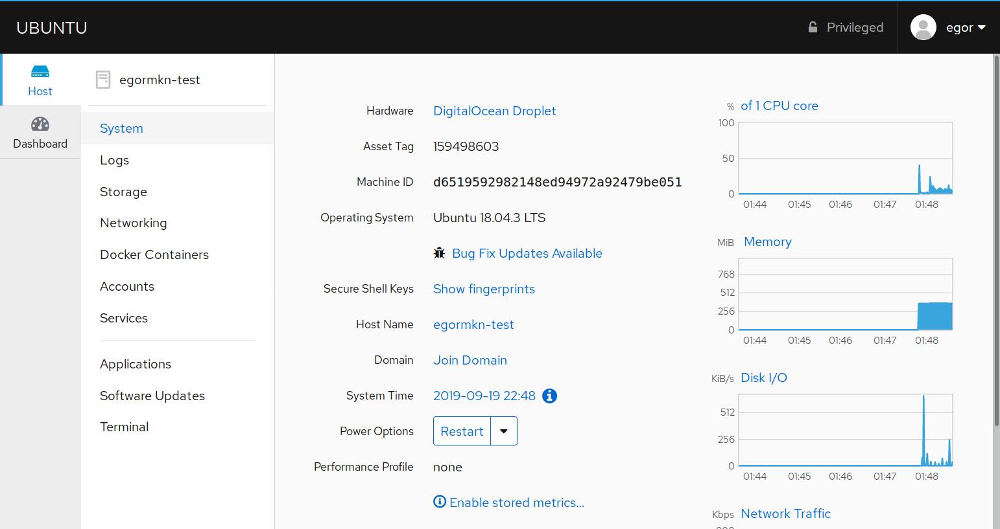
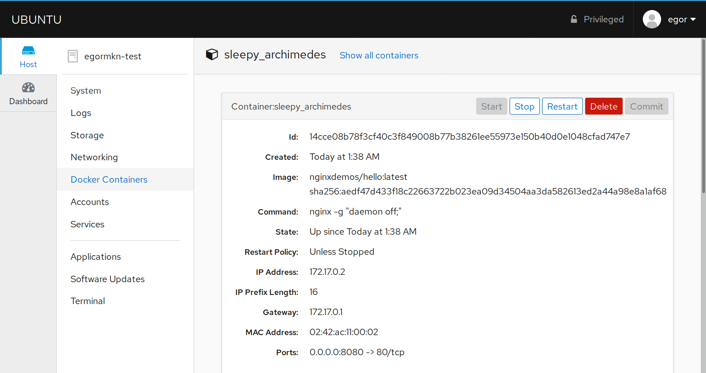
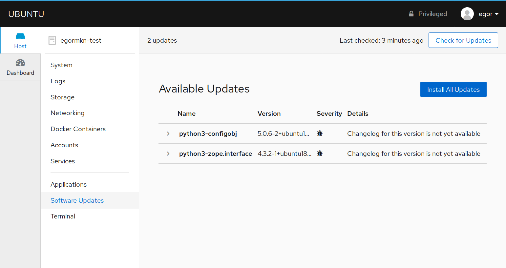
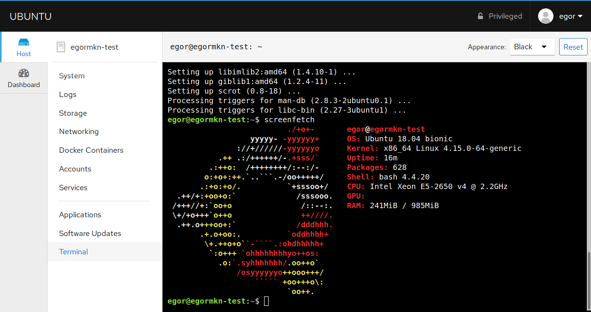

# Ubuntu Server Configuration

This guide will help you set up the [Ubuntu Server](https://ubuntu.com/download/server/) for deploying [Docker](https://docs.docker.com/) containers, that is managed by [Cockpit](https://cockpit-project.org/) control panel. Web applications in Docker containers might be associated with domain names using `VIRTUAL_HOST` environment variable. All domain names that are used with containers automatically get free SSL certificates from [LetsEncrypt](https://letsencrypt.org/).

I use this configuration on my virtual private server to play with any kind of dockerized applications. I will be glad if you find this guide useful.

## Screenshots

<a href="images/system.png"></a>&nbsp;&nbsp;&nbsp;<a href="images/docker.png"></a>
<a href="images/updates.png"></a>&nbsp;&nbsp;&nbsp;<a href="images/terminal.png"></a>

## Prerequisites
- Ubuntu Server 18.04 LTS with root access
- Domain name

## Setup

```bash
# Set an ip address of your server
SERVER="0.0.0.0"

# Open ssh connection to $SERVER as root
ssh root@$SERVER
```

```bash
#####################
### INITIAL SETUP ### 
#####################

# https://www.digitalocean.com/community/tutorials/initial-server-setup-with-ubuntu-18-04

# Set the preferred username or leave it as is
USERNAME="user"

# Create a new user with specified $USERNAME
adduser $USERNAME
# Add new user to the `sudo` group
usermod -aG sudo $USERNAME
# Update package registry
apt update
# Upgrade packages to newer versions
apt upgrade
# Install packages required for this tutorial
apt install git curl gnupg2 gnupg-agent lsb-release apt-transport-https software-properties-common
# Reboot server
shutdown -r now
```

```bash
# Open ssh connection to $SERVER as normal user
ssh user@$SERVER
```

```bash
#################
# INSTALL NGINX #
#################

# https://www.nginx.com/resources/wiki/start/topics/tutorials/install/

# Add NGINX official GPG key
curl -fsSL https://nginx.org/keys/nginx_signing.key | sudo apt-key add -
# Set up the stable repository
sudo add-apt-repository -y -u "deb http://nginx.org/packages/ubuntu $(lsb_release -cs) nginx"
# Install the latest stable version of NGINX
sudo apt install nginx
# Reload configuration
sudo nginx -s reload
```

```bash
####################
# INSTALL FIREWALL #
####################

# Install UFW
sudo apt install ufw
# Add firewall rules for HTTP, HTTPS and SSH
sudo ufw allow http
sudo ufw allow https
sudo ufw allow ssh
# Enable firewall (make sure you have allowed SSH before)
sudo ufw enable
```

```bash
##################
# INSTALL DOCKER #
##################

# https://docs.docker.com/install/linux/docker-ce/ubuntu/#install-using-the-repository

# Add Docker official GPG key
curl -fsSL https://download.docker.com/linux/ubuntu/gpg | sudo apt-key add -
# Set up the stable repository
sudo add-apt-repository -y -u "deb https://download.docker.com/linux/ubuntu $(lsb_release -cs) stable"
# Install the latest stable version of Docker CE
sudo apt install docker-ce docker-ce-cli containerd.io
```

```bash
######################
# INSTALL DOCKER-GEN #
######################

# https://github.com/jwilder/docker-gen#installation

DOCKER_GEN_VERSION="0.7.4"

# Download release archive
wget https://github.com/jwilder/docker-gen/releases/download/$DOCKER_GEN_VERSION/docker-gen-linux-amd64-$DOCKER_GEN_VERSION.tar.gz
# Extract binary executable
sudo tar xvzf docker-gen-linux-amd64-$DOCKER_GEN_VERSION.tar.gz -C /usr/local/bin/
# Remove downloaded archive
rm docker-gen-linux-amd64-$DOCKER_GEN_VERSION.tar.gz
```

```bash
###################
# INSTALL COCKPIT #
###################

# https://cockpit-project.org/running.html#ubuntu

# Install Cockpit with Docker plugin
sudo apt install -t $(lsb_release -cs)-backports cockpit cockpit-docker
```

```bash
###################
# INSTALL CERTBOT #
###################

# https://certbot.eff.org/lets-encrypt/ubuntubionic-nginx

# Set up the repository
sudo add-apt-repository -y -u ppa:certbot/certbot
# Install the latest version of certbot
sudo apt install certbot python-certbot-nginx
```

```bash
#########
# SETUP #
#########

# https://github.com/cockpit-project/cockpit/wiki/Proxying-Cockpit-over-NGINX
# https://docs.nginx.com/nginx/admin-guide/basic-functionality/managing-configuration-files/

DOMAIN="cockpit.domain.tld"

# Get configuration files
git clone https://github.com/egormkn/cockpit-docker-server.git
cd cockpit-docker-server
# Copy all configuration files to system
sudo cp -r etc/ /
# Set domain name in configuration files
sudo sed -i "s/cockpit.domain.tld/$DOMAIN/g" /etc/cockpit/cockpit.conf
sudo sed -i "s/cockpit.domain.tld/$DOMAIN/g" /etc/nginx/conf.d/cockpit.conf
# Remove default server block that serves NGINX welcome page
sudo rm -f /etc/nginx/conf.d/default.conf
# Generate default NGINX certificate with CN=*
sudo openssl req -x509 -nodes -days 1000 -newkey rsa:2048 -keyout /etc/nginx/ssl/nginx.key -out /etc/nginx/ssl/nginx.crt
# Register account for Certbot
sudo certbot register
# Setup SSL for cockpit
sudo certbot run --nginx --no-redirect -d $DOMAIN
# Allow execution of docker-gen notify script
sudo chmod +x /etc/docker-gen/notify.sh
# Reload services list
sudo systemctl daemon-reload
# Enable docker-gen service
sudo systemctl enable docker-gen.service
# Reboot server
sudo shutdown -r now
```

## Usage

### Run Docker containers with domain name

```bash
sudo docker run -e VIRTUAL_HOST=test.cockpit.example.com -P -d nginxdemos/hello
# Or with specified port
sudo docker run -e VIRTUAL_HOST=test.cockpit.example.com -e VIRTUAL_PORT=3000 -P -d nginxdemos/hello
```

For more advanced configurations please see [docker-gen](https://github.com/jwilder/docker-gen) environment variables.

## Useful links
- https://tutorials.technology/tutorials/30-how-to-use-nginx-reverse-proxy-with-docker.html
- https://blog.ippon.tech/set-up-a-reverse-proxy-nginx-and-docker-gen-bonus-lets-encrypt/
- https://chrissainty.com/how-i-dockerised-my-blog/
- https://github.com/jwilder/nginx-proxy
- https://www.digitalocean.com/community/tutorials/how-to-set-up-nginx-server-blocks-on-centos-7
- https://traefik.io/
